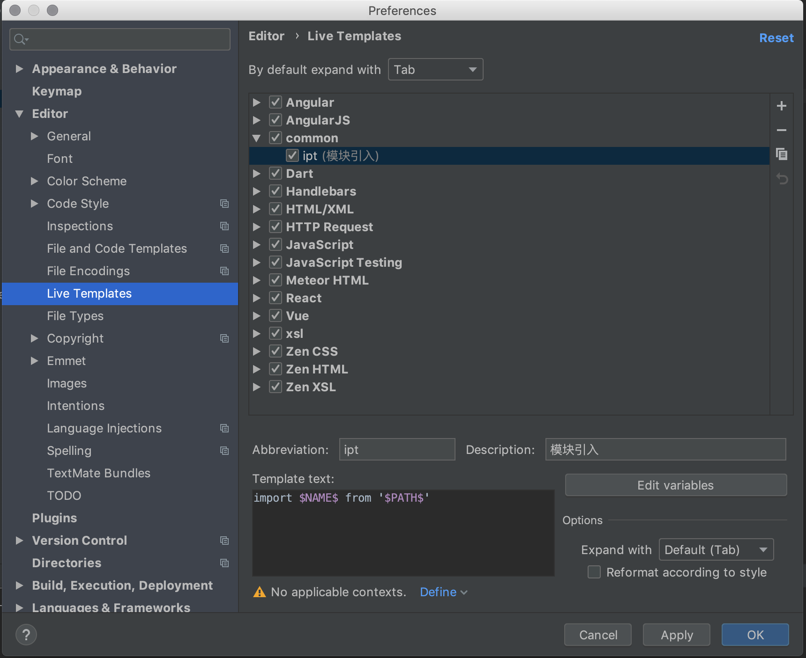

##### IntelliJ 添加自定义快捷短语
> 以Mac下WebStorm为例

- 打开配置项 
    - WebStorm -> Preferences -> Live Templates
    - 或者按 ⌘ + ,
- 点击右上角 + 号 
    - Live Template (模板)
    - Template Group (分组)
- 先添加分组 common
- 在分组下面添加模板

